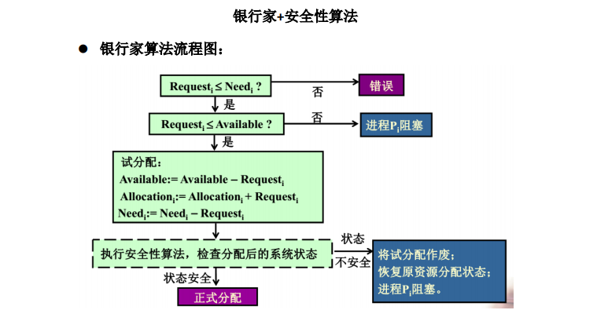
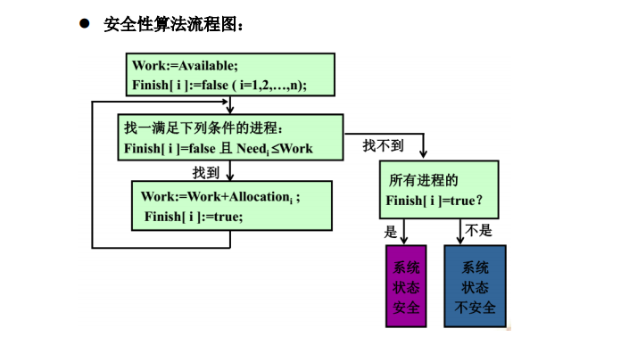
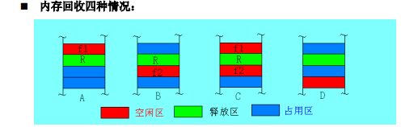
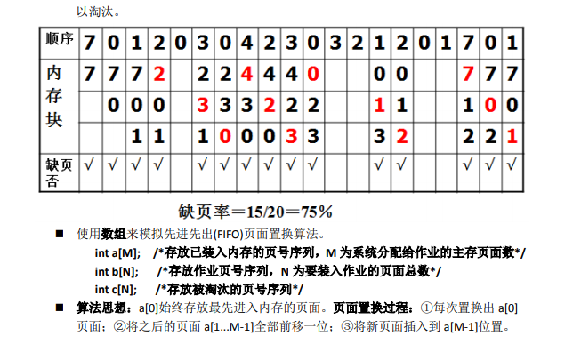
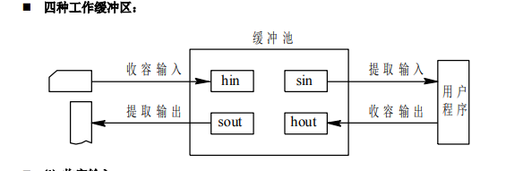

# Operation-System
下面是我在学习操作系统中写的一些操作系统常用算法   
写于2018年 大二上学期  我对它们进行了整理   
通过敲完这些算法 会让你更理解操作系统的原理  
使用 VC6.0 和 CB环境都行  
纯C语言编写   

### 银行家算法自然语言描述：  
设 Requesti是进程 Pi的请求向量，如果 Requesti［j］=K，表示进程 Pi需要 K 个 Rj类型 
的资源。当 Pi发出资源请求后，系统按下述步骤进行检查： 
(1) 如果 Requesti［j］≤Need［i,j］，便转向步骤 2；否则认为出错，因为它所需要的资源数 
已超过它所宣布的最大值。
(2) 如果 Requesti［j］≤Available［j］，便转向步骤(3)；否则， 表示尚无足够资源，Pi 须等
待。 
(3) 系统试探着把资源分配给进程 Pi，并修改下面数据结构中的数值： 
Available［j］=Available［j］-Requesti［j］; 
Allocation［i,j］=Allocation［i,j］+Requesti［j］; 
Need［i,j］=Need［i,j］-Requesti［j］; 
(4) 系统执行安全性算法，检查此次资源分配后，系统是否处于安全状态。若安全，才正式 
将资源分配给进程 Pi，以完成本次分配；否则， 将本次的试探分配作废，恢复原来的 
资源分配状态，让进程 Pi等待。 

 
安全性算法自然语言描述： 
(1) 设置两个向量：① 工作向量 Work: 它表示系统可提供给进程继续运行所需的各类资源 
数目，它含有 m 个元素，在执行安全算法开始时，Work∶=Available; ② Finish: 它表示 
系统是否有足够的资源分配给进程，使之运行完成。开始时先做 Finish［i］∶=false; 当 
有足够资源分配给进程时， 再令 Finish［i］∶=true。 
(2) 从进程集合中找到一个能满足下述条件的进程： 
① Finish［i］=false; ② Need［i,j］≤Work［j］； 若找到， 执行步骤(3)， 否则，执行 
步骤(4) 
(3) 当进程 Pi 获得资源后，可顺利执行，直至完成，并释放出分配给它的资源，故应执行： 
Work［j］∶ ［i］+Allocation［i,j］ 
Finish［i］∶ 
go to step (2); 
(4) 如果所有进程的 Finish［i］=true 都满足， 则表示系统处于安全状态；否则，系统处于 
不安全状态。 

### 模拟先来先服务（FCFS）调度算法    
按照 FCFS 调度进程  
 动态地输入进程(key,sequence,message)，按照输入次序建立队列 
 按照 FCFS 的次序模拟进程逐个被调度并进入 CPU 运行的过程 
 

### 模拟进程优先级调度   
1. 按照优先级出列 
 动态地输入进程，按照输入次序建立队列 
 按照优先级的次序将队列中的进程逐个出队 
 2. 按照优先级入列 
 动态地输入进程，按照优先级建立优先级队列 
 按照前后次序将队列中的进程逐个出队 

### 模拟时间片轮转调度算法 
按照时间片轮转调度进程 
 动态地输入进程(key,run_time,message)，按照输入次序建立就绪队列 
 输入 CPU 运行的单位时间片(cpu_base_time) 
 按照时间片轮转方式模拟进程逐个被调度并执行单位时间片(运行结束进程结束，否则 
修改进程运行时间 run_time,将该进程放置在就绪队列尾巴)。 

### 模拟首次适应（First Fit）算法 
 首次适应算法 FF(First Fit) 
 基本思想：要求空闲分区按地址递增的次序排列。当进行内存分配时，从空闲区表 
头开始顺序查找，直到找到第一个能满足其大小要求的空闲区为止。分一块给请求 
者，余下部分仍留在空闲区中。 
实例：某系统内存容量为 800K，下面分别给出中的空闲分区表和分配分区表，系统采用动 
态分区存储管理策略。现有以下作业序列：96K（作业名：A），20K（作业名：B），200K（作 
业名：C）。请用首次适应 FF 算法来处理这些作业序列，并打印出该算法分配空间后的空闲 
分区表和分配分区表。(若出现内存不足的情况，请提示作业等待内存资源) 
分配分区表： 
作业名 大小 起始地址 
OS 60K 0 K 
Task1 40K 60K 
Task2 18K 132K 
Task3 40K 160K 
Task4 15K 205K 
Task5 92K 438K 
Task6 174K 626K 
空闲分区表： 
大小 起始地址 
32K 100K 
10K 150K 
5K 200K 
218K 220K 
96K 530K 
按照 FF 算法分配内存： 
 动态地任意顺序输入“分配分区表项”，按照地址递增方式建立“分配分区表” 

### 模拟最佳适应（Best Fit）算法 
 最佳适应算法 BF(Best Fit) 
 基本思想：BF 的空闲分区表（或空闲分区链）按空闲区大小的升序方式组织。分配 
时，按空闲分区表（或空闲分区链）的先后次序，从头查找，找到符合要求的第一 
个分区。就说明它是最适合的（即最佳的）。大的空闲区可以被保留下来。 

###  模拟内存回收算法 
 内存回收四种情况： 
 
实例：某系统内存容量为 800K，下面分别给出中的空闲分区表和分配分区表，系统采用动 
态分区存储管理策略。现有按照如下顺序释放作业空间： (1)释放作业：Task2 【情况 D】； 
(2)释放作业：Task4 【情况 A】；(3)释放作业：Task6 【情况 B】；(4)释放作业：Task7 【情 
况 C】；(5)释放作业：Task9 【不存在】并打印每次回收分配空间后的空闲分区表和分配分 
区表。 

### 模拟先进先出(FIFO)页面置换算法 
 置换策略：总是淘汰最先进入内存的页面，即选择在内存中驻留时间最久的页面予 
以淘汰。 
 

### 模拟最近最久未使用(LRU)页面置换算法 
 置换策略：选择最近最久未使用的页面予以淘汰，系统在每个页面设置一个访问字 
段，用以记录这个页面自上次被访问以来所经历的时间 T ，当要淘汰一个页面时， 
选择 T 最大的页面。 
 使用数组来模拟最近最久未使用(LRU)页面置换算法。 
 int a[M]; /*存放已装入内存的页号序列，M 为系统分配给作业的主存页面数*/ 
 int b[N]; /*存放作业页号序列，N 为要装入作业的页面总数*/ 
 int c[N]; /*存放被淘汰的页号序列*/ 
 算法思想：a[0]始终存放最近最久未使用的页面，a[M-1]存放最近刚被使用的页面。 
(1) 当待访问页面 b[i]在内存数组 a 中下标 k 时，处理过程：①将页面 a[k+1]...a[M-1] 
全部前移一位；②将页面 b[i]放置在 a[M-1]位置。 
(2) 当待访问页面 b[i]不在内存，发生缺页且内存已满时，置换过程：①每次置换出 
a[0]页面；②将页面 a[1]...a[M-1]全部前移一位；③将新页面插入到 a[M-1]位置。 

### 模拟缓冲池（Buffer Pool） 
 基本思想： 对于既可用于输入又可用于输出的公用缓冲池， 其中至少应含有以下 
三种类型的缓冲区：① 空(闲)缓冲区；②装满输入数据的缓冲区； ③装满输出数 
据的缓冲区。 为了管理上的方便，可将相同类型的缓冲区链成一个队列，于是可形 
成以下三个队列： 
(1)空缓冲队列 emq：由空缓冲区所链成的队列。 
(2)输入队列 inq：由装满输入数据的缓冲区所链成的队列。 
(3)输出队列 outq：由装满输出数据的缓冲区所链成的队列。 
 
 ⑴ 收容输入： 
用于收容输入数据的工作缓冲区（hin） 
 输入进程可调用 Getbuf(emq)过程，从空缓冲队列 emq 的队首摘下一空缓冲 
区，把它作为收容输入工作缓冲区 hin。 
 然后，把数据输入其中，装满后再调用 Putbuf(inq，hin)过程，将它挂在输入 
队列 inq 队列上。 
 ⑵ 提取输入： 
用于提取输入数据的工作缓冲区（sin） 
 计算进程可调用 Getbuf(inq)过程，从输入队列 inq 的队首取得一缓冲区，作 
为提取输入工作缓冲区 sin，计算进程从中提取数据。 
 计算进程用完该数据后，再调用 Putbuf(emq，sin)过程，将它挂到空缓冲队 
列 emq 上。 
 ⑶ 收容输出： 
用于收容输出数据的工作缓冲区（hout） 
 计算进程可调用 Getbuf(emq)，从空缓冲队列 emq 的队首取得一空缓冲，作 
为收容输出工作缓冲区 hout。 
 当其中装满输出数据后，又调用 Putbuf(outq，hout)过程，将它挂在 outq 末 
尾。
 ⑷ 提取输出： 
 用于提取输出数据的工作缓冲区（sout） 
 输出进程可调用 Getbuf(outq)过程，从输出队列的队首取得一装满输出数据 
的缓冲区，作为提取输出工作缓冲区 sout。 
 在数据提取完后，再调用 Putbuf(emq，sout)过程，将它挂在空缓冲队列末尾。 

### 模拟最短寻道时间优先 SSTF 算法 
 最短寻道时间优先 SSTF(Shortest Seek Time First)算法：选择这样的进程，其要求访 
问的磁道与当前磁头所在的磁道距离最近，以使每次的寻道时间最短。 
 例：假定有一个具有 200 个磁道（编号为 0~199）的移动头磁盘，若磁头的当前位 
置为 100 磁道，磁头正向磁道号增加方向移动。现有一个磁盘读写请求队列：55， 
58，39，18，90，160，150，38，184。若采用最短寻址时间优先调度算法，试计 
算平均寻道长度各为多少？ 

### 模拟电梯调度算法 
 电梯调度算法：不仅考虑到欲访问的磁道与当前磁道的距离，更优先考虑的是磁头 
的当前移动方向。例如：当磁头正在由里向外移动时，SCAN 算法所选择的下个访问 
对象应是其欲访问的磁道既在当前磁道之外，又是距离最近的。这样由里向外地访 
问，直至再无更外的磁道需要访问时，才将磁臂换向，由外向里移动。这时，同样 
也是每次选择这样的进程来调度，即其要访问的磁道，在当前磁道之内，且距离最 
近者，这样，磁头又是逐步地向里移动，直至再无更里面一些的磁道要访问，从而 
避免了饥饿现象的出现。这种算法中，磁头移动的规律颇似电梯的运行，故又常称 
为电梯调度算法。 
 例：假定有一个具有 200 个磁道（编号为 0~199）的移动头磁盘，若磁头的当前位 
置为 100 磁道，磁头正向磁道号增加方向移动。现有一个磁盘读写请求队列：55， 
58，39，18，90，160，150，38，184。若采用扫描算法，试计算平均寻道长度各 
为多少？

